# PENJELASAN

1. Membuat Proyek di Firebase
  -Pertama, kita membuat proyek di Firebase dan mengaktifkan Google sebagai penyedia autentikasi di bagian Authentication.
  -Setelah proyek dibuat, Firebase menghasilkan konfigurasi khusus (firebaseConfig) untuk aplikasi kita, yang akan kita gunakan untuk menginisialisasi Firebase di dalam aplikasi Ionic.
2. Membuat Proyek Ionic dengan Vue.js
 -Setelah menyiapkan proyek Firebase, kita membuat proyek Ionic baru dengan template Vue. Kita juga menginstal Pinia untuk state management dan Firebase SDK untuk mengelola autentikasi Firebase.
 -Struktur folder proyek Ionic mencakup beberapa folder penting seperti src untuk menyimpan kode aplikasi, public untuk aset, router untuk mengatur navigasi, dan stores untuk menyimpan status autentikasi menggunakan Pinia.
3. Inisialisasi Firebase dalam Proyek Ionic
 -Kita membuat file firebase.ts di dalam folder utils untuk menginisialisasi Firebase menggunakan konfigurasi yang diambil dari Firebase Console.
 -Dalam file ini, kita juga menginisialisasi auth untuk autentikasi dan googleProvider untuk penyedia autentikasi Google.
4. Membuat Fungsi Autentikasi (Sign-In dan Logout)
 -Dalam folder stores, kita membuat file auth.ts yang menggunakan Pinia untuk mengelola status autentikasi pengguna.
 -Di sini, fungsi loginWithGoogle dibuat untuk menginisialisasi autentikasi Google. Dengan GoogleAuth, aplikasi akan meminta akses ke profil dan email pengguna. 
 -Setelah pengguna berhasil masuk, aplikasi mendapatkan token ID dari Google yang dikonversi menjadi kredensial Firebase, dan kemudian digunakan untuk melakukan signInWithCredential.
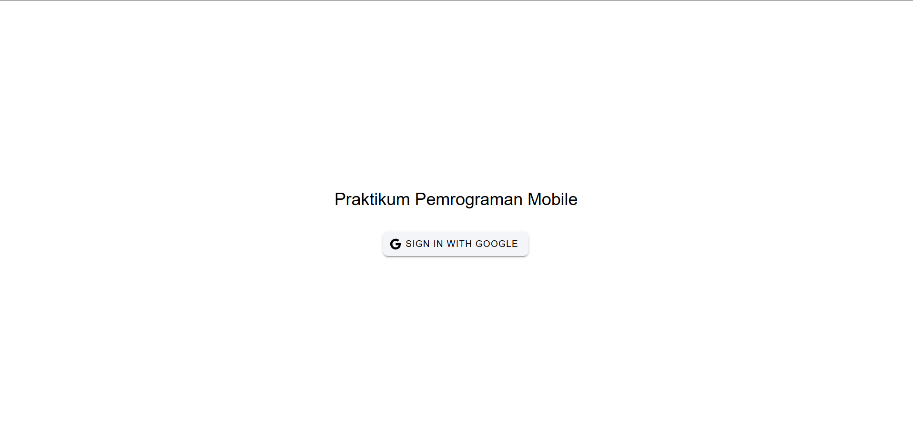
 -Setelah masuk, pengguna diarahkan ke halaman beranda (/home).
 -Fungsi logout disediakan untuk keluar dari akun Google, menghapus sesi, dan mengarahkan pengguna kembali ke halaman login (/login).
6. Membuat Halaman Login dan Profile
 -LoginPage: Halaman ini berisi tombol yang memungkinkan pengguna masuk dengan akun Google. Saat tombol ditekan, fungsi loginWithGoogle dipanggil, memicu proses autentikasi.
 -HomePage dan ProfilePage: Halaman profil menampilkan informasi pengguna seperti nama dan email yang diperoleh dari Google. Komponen TabsMenu memungkinkan navigasi antara halaman utama (Home) dan profil (Profile).
 -Pada halaman profil, kita menggunakan authStore untuk mendapatkan detail pengguna, termasuk nama dan URL foto profil. Jika gambar profil tidak tersedia, kita menampilkan gambar default.
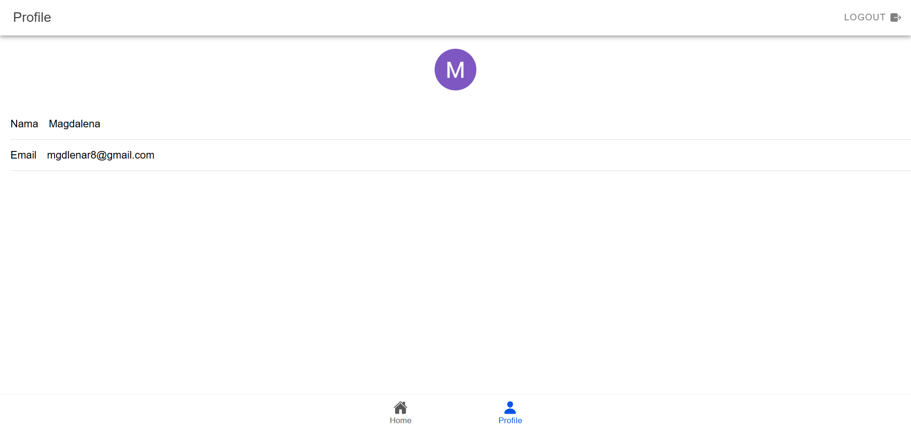
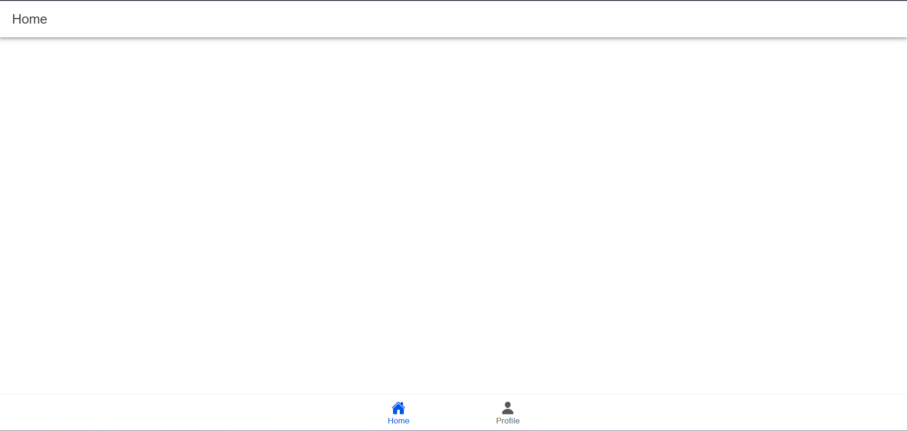
8. Konfigurasi Router dengan Perlindungan Rute
 -Dalam file index.ts di folder router, kita mengatur rute aplikasi dan melindungi halaman beranda dan profil agar hanya bisa diakses oleh pengguna yang sudah login.
 -Pada setiap perubahan rute, kita menggunakan beforeEach untuk mengecek apakah pengguna sudah terautentikasi atau belum. Jika belum, pengguna akan diarahkan ke halaman login.

# LANJUTAN PROGRAM

1. Konfigurasi Firestore
Inisialisasi Firestore: Anda menghubungkan aplikasi Ionic dengan Firebase dan mengatur database Firestore dengan mode test.
Implementasi Firestore: File firestore.ts dibuat untuk mendukung operasi CRUD dengan struktur koleksi users/{uid}/todos.
Fungsi CRUD:

Add Todo: Menambahkan dokumen baru.
Get Todos: Mengambil daftar dokumen dari koleksi pengguna.
Update Todo: Memperbarui dokumen berdasarkan ID.
Delete Todo: Menghapus dokumen berdasarkan ID.
Update Status: Mengubah status dokumen dari aktif menjadi selesai atau sebaliknya.
2. Persiapan Project Ionic
Komponen Menu: TabsMenu dipindahkan ke App.vue agar bisa diatur kapan munculnya, khususnya tidak muncul di halaman login.
Penyesuaian Tampilan: CSS khusus untuk komponen Todo dibuat agar mendukung fitur scroll, responsif, dan estetika yang baik.
3. Pembuatan Halaman Home
Halaman HomePage.vue adalah pusat tampilan aplikasi.

Refresher: Digunakan untuk memuat ulang data saat halaman ditarik ke bawah.
Todo List: Terbagi menjadi Active Todos dan Completed Todos. Tiap todo memiliki opsi seperti edit, delete, dan update status melalui aksi klik atau geser (swipe).
Floating Action Button (FAB): Tombol untuk membuka modal input data Todo.
Input Modal: Modal ini digunakan untuk menambahkan atau mengedit Todo. Data dikirim melalui fungsi handleSubmit.
4. Logika Fungsi Utama
Fungsi Data Management:

loadTodos: Mengambil daftar Todo dari Firestore.
handleRefresh: Memuat ulang data Todo.
handleSubmit: Menambahkan atau mengedit Todo.
handleEdit, handleDelete, dan handleStatus: Mengatur aksi pada Todo seperti mengubah status atau menghapus.
Toast Notifications: Memberikan feedback kepada pengguna (misalnya saat Todo berhasil ditambahkan atau terjadi kesalahan).
Relative Time: Menampilkan waktu last update Todo dalam format relatif, seperti "2 minutes ago".

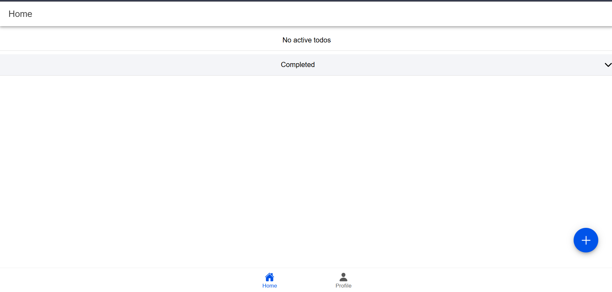
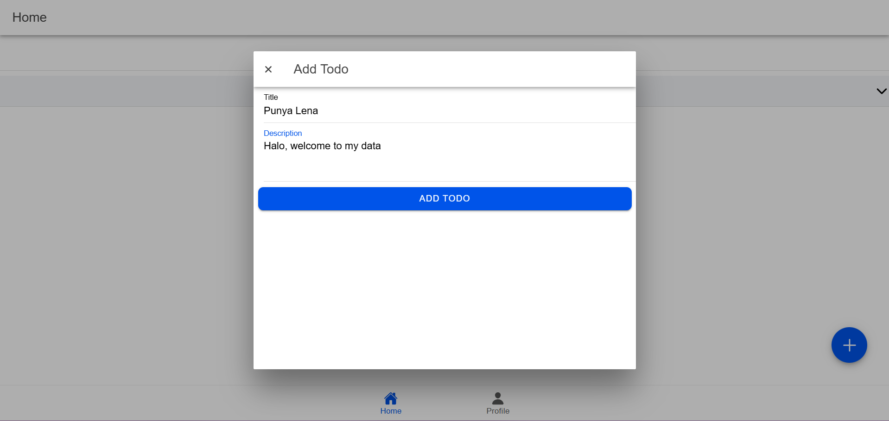
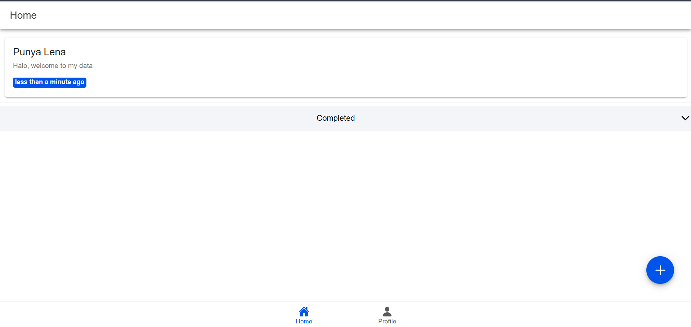
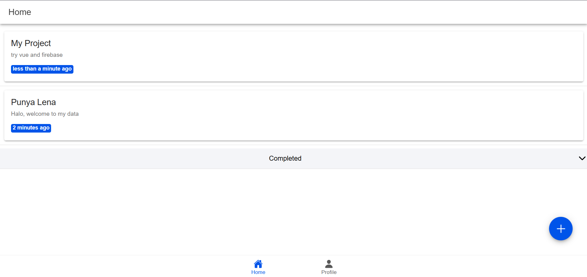
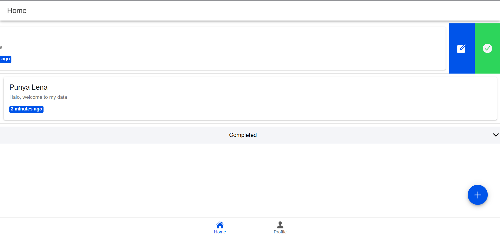
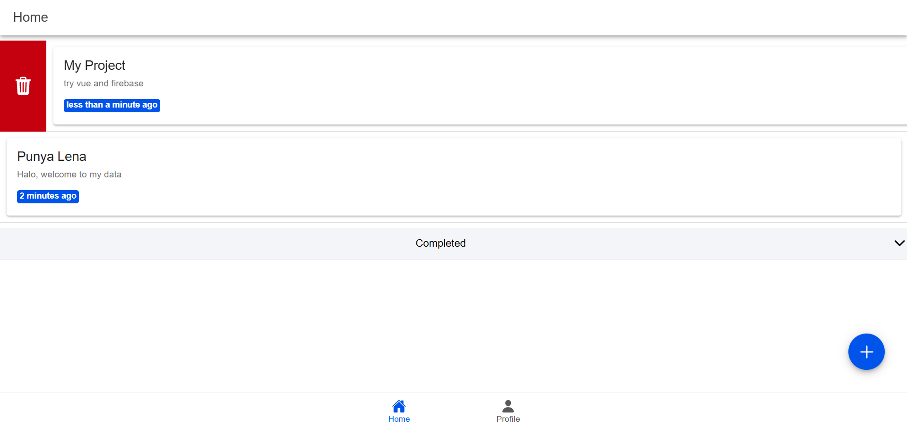
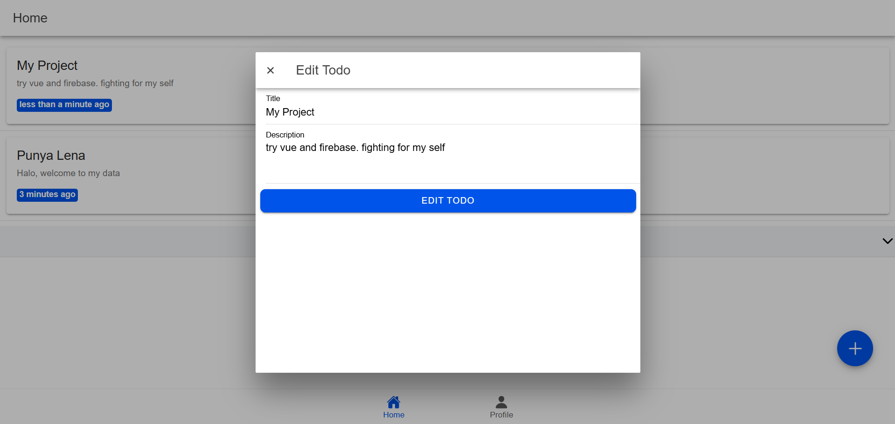
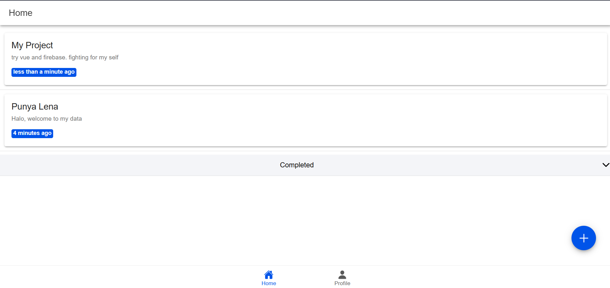
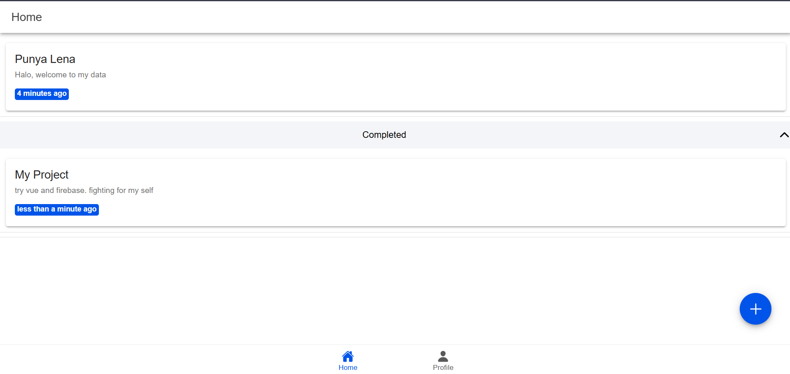
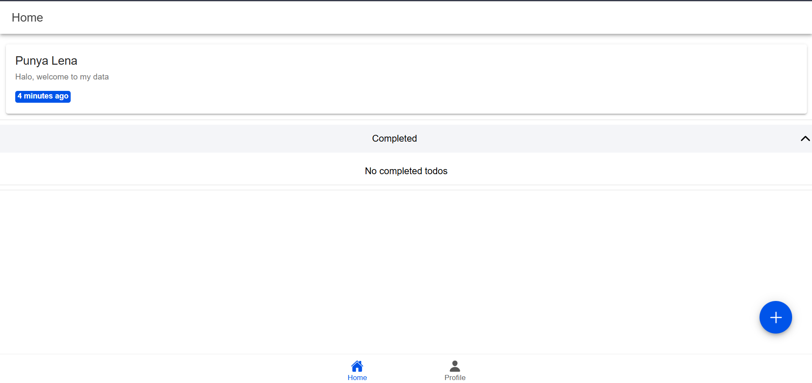
