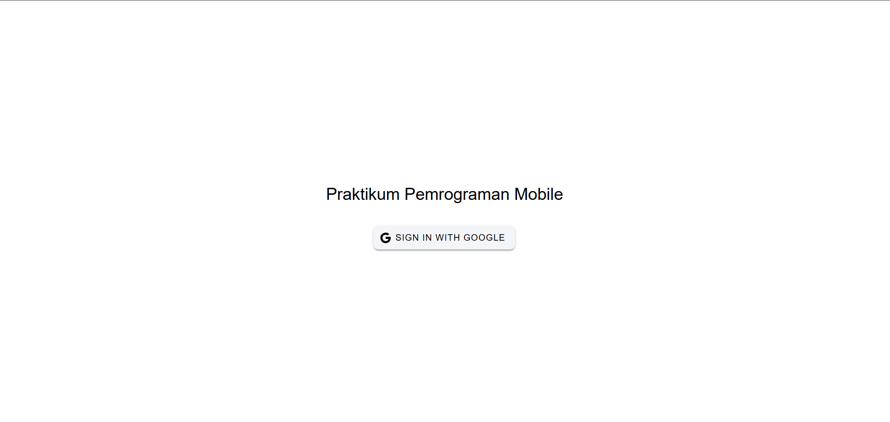
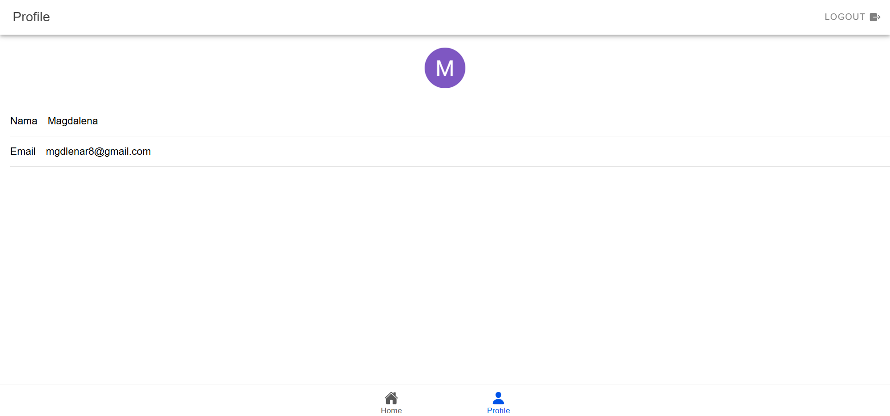
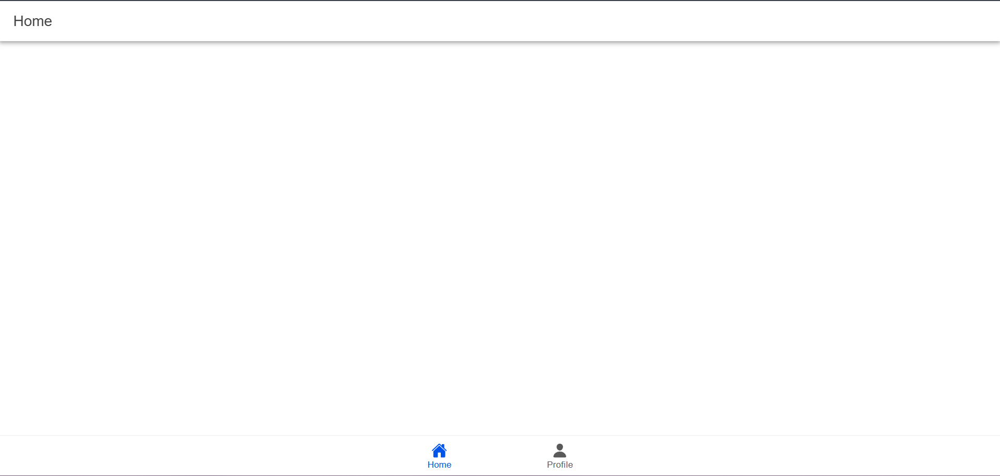

# Tugas 9 - Pertemuan 10
1. Membuat Proyek di Firebase
    a. Pertama, kita membuat proyek di Firebase dan mengaktifkan Google sebagai penyedia autentikasi di bagian Authentication.
    b. Setelah proyek dibuat, Firebase menghasilkan konfigurasi khusus (firebaseConfig) untuk aplikasi kita, yang akan kita gunakan untuk menginisialisasi Firebase di dalam aplikasi Ionic.
2. Membuat Proyek Ionic dengan Vue.js
    a. Setelah menyiapkan proyek Firebase, kita membuat proyek Ionic baru dengan template Vue. Kita juga menginstal Pinia untuk state management dan Firebase SDK untuk mengelola autentikasi Firebase.
    b. Struktur folder proyek Ionic mencakup beberapa folder penting seperti src untuk menyimpan kode aplikasi, public untuk aset, router untuk mengatur navigasi, dan stores untuk menyimpan status autentikasi menggunakan Pinia.
3. Inisialisasi Firebase dalam Proyek Ionic
    a. Kita membuat file firebase.ts di dalam folder utils untuk menginisialisasi Firebase menggunakan konfigurasi yang diambil dari Firebase Console.
    b. Dalam file ini, kita juga menginisialisasi auth untuk autentikasi dan googleProvider untuk penyedia autentikasi Google.
4. Membuat Fungsi Autentikasi (Sign-In dan Logout)
    a. Dalam folder stores, kita membuat file auth.ts yang menggunakan Pinia untuk mengelola status autentikasi pengguna.
    b. Di sini, fungsi loginWithGoogle dibuat untuk menginisialisasi autentikasi Google. Dengan GoogleAuth, aplikasi akan meminta akses ke profil dan email pengguna. Setelah pengguna berhasil masuk, aplikasi mendapatkan token ID dari Google yang dikonversi menjadi kredensial Firebase, dan kemudian digunakan untuk melakukan signInWithCredential.
    c. Setelah masuk, pengguna diarahkan ke halaman beranda (/home).
Fungsi logout disediakan untuk keluar dari akun Google, menghapus sesi, dan mengarahkan pengguna kembali ke halaman login (/login).
5. Membuat Halaman Login dan Profile
    a. LoginPage: Halaman ini berisi tombol yang memungkinkan pengguna masuk dengan akun Google. Saat tombol ditekan, fungsi loginWithGoogle dipanggil, memicu proses autentikasi.
    b. HomePage dan ProfilePage: Halaman profil menampilkan informasi pengguna seperti nama dan email yang diperoleh dari Google. Komponen TabsMenu memungkinkan navigasi antara halaman utama (Home) dan profil (Profile).
    c. Pada halaman profil, kita menggunakan authStore untuk mendapatkan detail pengguna, termasuk nama dan URL foto profil. Jika gambar profil tidak tersedia, kita menampilkan gambar default.
6. Konfigurasi Router dengan Perlindungan Rute
    a. Dalam file index.ts di folder router, kita mengatur rute aplikasi dan melindungi halaman beranda dan profil agar hanya bisa diakses oleh pengguna yang sudah login.
    b. Pada setiap perubahan rute, kita menggunakan beforeEach untuk mengecek apakah pengguna sudah terautentikasi atau belum. Jika belum, pengguna akan diarahkan ke halaman login.
7. Alur Autentikasi dan Mendapatkan Data Profil
    a. Ketika pengguna menekan tombol Sign In with Google di halaman login, loginWithGoogle memulai proses autentikasi dengan Google.
      
    b. Setelah pengguna berhasil login, aplikasi mengambil token ID dari Google dan mengonversinya ke kredensial Firebase. Firebase kemudian menandai pengguna sebagai terautentikasi dan menyimpan informasi seperti nama dan foto profil.
     
    
   c. Informasi ini disimpan di authStore dan digunakan di seluruh aplikasi untuk menampilkan profil dan menentukan status autentikasi.
